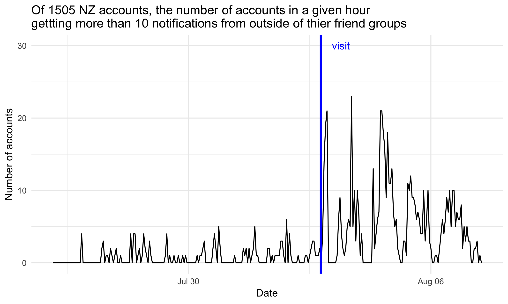

## Dataset

- From targetted searches & capturing at time
- 2018-07-25 13:03:40 to 2018-08-06 23:45:21 UTC
- 115218 tweets, 3065709 mentions
- 373693 accounts loosely involved
- 40798 accounts tightly involved
- 53900649 friends relationships
- 21366303 likes

## Backstory

<!-- -->

## Composition

<!-- -->

## Politics - notifiers

<!-- -->

## Community

<!-- -->

## Time

<!-- -->

## Language (1) Rate difference

<!-- -->

## Language (2) Absolute difference

<!-- -->

## Uneven

<!-- -->

## Possible Responses

- all along the watchtower
- pick on someone your own size
- burn it all down
